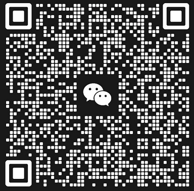

# ChatBook

主要面向企业/政府/学校/其它组织,提供组织内部知识库管理和服务,使用企业私有数据进行投喂进行训练数据,然后提供给用户使用.
使用场景:
    1 行业性垂直网站: 如房产领域,可以提供房产法规,交易,政策性咨询等服务.
    2 客户服务: 智能化的客户服务,可以帮企业节约客户服务成本.
    3 数据分析: 企业内部数据分析

## 编译安装
```
npm install
npm run dev
```
后端使用serverless function, 数据目录是在安装目录的./data下面.

## 支持模型
```
ChatGPT
Google Gemini
Facebook Llama 2
Baidu Wenxin
```

## 技术架构
    1 LLM:  Langchain, Pinecone, OPENAI, 后续会持续集成其它模型
    2 后端: Electron, Express
    3 前端: React, NEXT, MUI

## 微信交流群组

